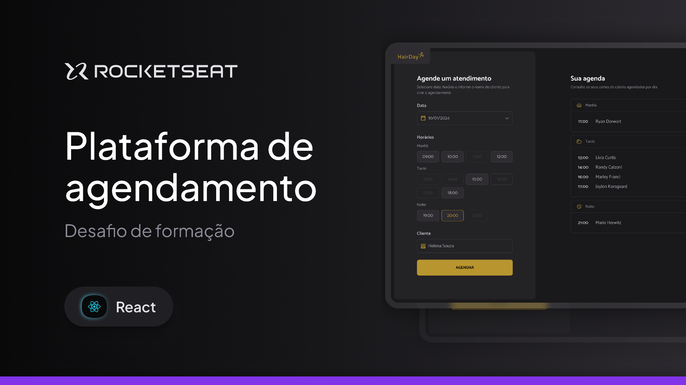

<div align="center">
  
</div>

<h1 align="center">HairDay - Sistema de Agendamentos</h1>

<p align="center">
  Aplicacao desenvolvida no desafio da formacao <strong>React 2025</strong> da Rocketseat. 🚀
</p>

<p align="center">
  <a href="https://hair-day-orcin.vercel.app"><strong>Aplicação</strong></a>
  ·
  <a href="https://www.figma.com/community/file/1550912897463432409"><strong>Figma</strong></a>
</p>

---



## Aplicacao online

- Acesse: **[https://hair-day-orcin.vercel.app](https://hair-day-orcin.vercel.app)**

## Sobre o projeto

O HairDay e uma aplicacao para gerenciamento de agendamentos. O projeto foi criado para praticar fundamentos essenciais do React:

- Gerenciamento de estado
- Atualizacao imutavel de dados
- Renderizacao de listas
- Componentizacao com props
- Manipulacao de formularios

## Funcionalidades

- Cadastro de agendamento com nome do cliente, data e horario
- Exclusao de agendamento por icone de lixeira
- Agrupamento automatico por periodos (manha, tarde e noite)
- Mensagem de estado vazio por periodo sem agendamentos
- Persistencia local dos dados no navegador

### Periodos de atendimento

- Manha: 09h as 12h
- Tarde: 13h as 18h
- Noite: 19h as 21h

## Analise tecnica da aplicacao

- Arquitetura modular com separacao em `components`, `hooks`, `models` e `pages`
- Roteamento com `react-router` para tela principal e pagina de componentes
- Estado principal encapsulado em hooks customizados para facilitar manutencao
- Regras de data e filtro por horario implementadas com `dayjs`
- Interface baseada em utilitarios do Tailwind com variacoes via CVA

## Tecnologias

| Categoria | Tecnologias |
| --- | --- |
| Core | React 19, TypeScript, Vite |
| Roteamento | React Router |
| Estilizacao | Tailwind CSS 4, class-variance-authority, tailwind-merge |
| Dados e utilitarios | Day.js, use-local-storage |
| Build e DX | vite-plugin-svgr, ESLint |

## Estrutura de pastas

```txt
src
├─ assets
├─ components
├─ hooks
├─ models
├─ pages
├─ App.tsx
└─ main.tsx
```

## Como executar

```bash
# clonar o repositorio
git clone https://github.com/GabrielCardosoLIma/hair-day.git

# entrar na pasta
cd hair-day

# instalar dependencias
npm install

# iniciar o projeto
npm run dev
```

## Scripts disponiveis

- `npm run dev` - executa em ambiente de desenvolvimento
- `npm run build` - gera build de producao
- `npm run preview` - visualiza build localmente
- `npm run lint` - executa verificacao de lint

## Checklist do desafio

- [x] Projeto com React + Vite + TypeScript
- [x] Sidebar para criacao de agendamentos
- [x] Listagem por periodos
- [x] Adicionar agendamento
- [x] Remover agendamento
- [x] Estado vazio por periodo

---

Feito por <strong>Gabriel Cardoso Lima</string> 👋
